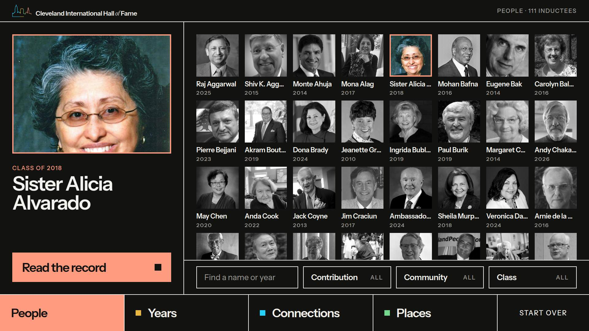
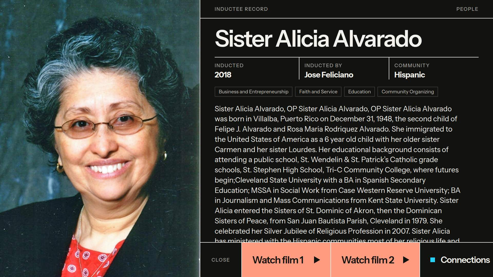
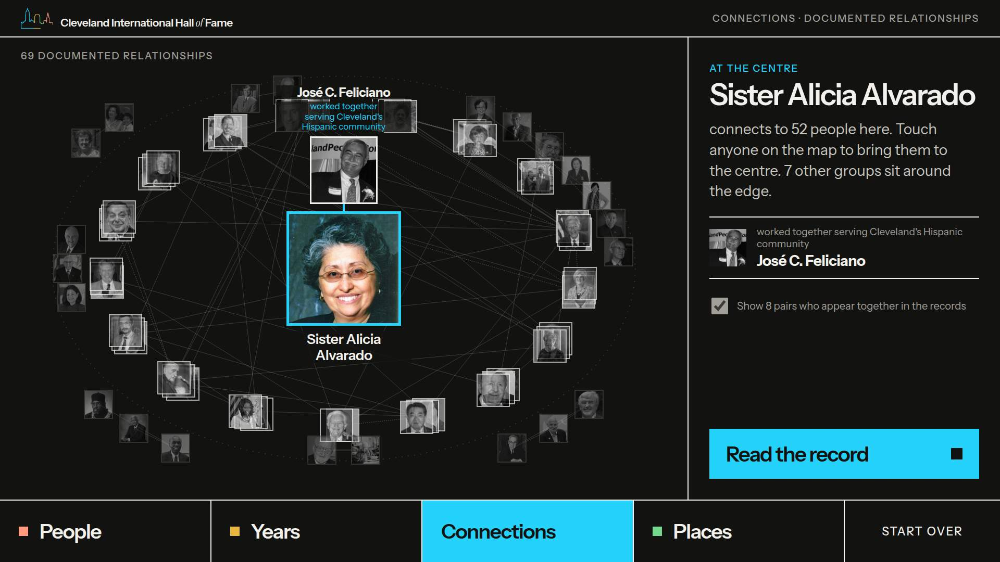
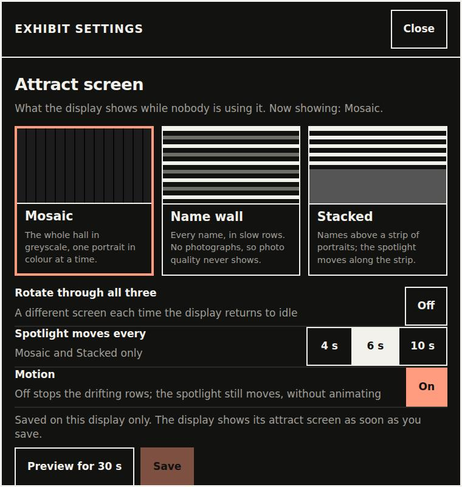

# The Hall of Fame display: a walkthrough for gallery staff

About fifteen minutes to read, and best read standing at the display. It
covers what visitors see, what to check each day, and what to do when
something looks wrong. The staff guide (`docs/staff-guide.md`, or
`STAFF-GUIDE.md` beside each release) has the full detail; section numbers
below point into it.

---

## 1. What a visitor sees

### The attract screen

When nobody is using the display, it shows the **attract screen**: every
inductee's portrait in grey, one lit up in colour at a time, and a call to
action along the bottom. Its job is to invite someone over.

- Touching a **face** opens that person.
- Touching **"Touch any face"** (the coral bar) opens the whole collection.

There are three versions of the attract screen: portraits (as here), a wall
of names, or both. Which one shows is chosen in the admin panel (section 4
below).

### Exploring

Everything a visitor needs is along the **bottom** of the screen, within
reach of someone standing or seated:

- four tabs, each with its own colour: **People**, **Years**,
  **Connections**, **Places**;
- **Start over**, which goes back to the attract screen.

Touching a portrait chooses that person: it turns from grey to colour, and
their name appears on the left. **Read the record** opens their full story.
**Years** and **Places** work the same way: touch a portrait, then **Read
the record**.

The record has its actions along the bottom too: **Close**, **Watch the
film** when there is one, **Connections**, and **Take it with you** (a code
for a phone) when the website is set up.

**Connections** shows only relationships a curator has checked against the
records. Touching anyone brings them to the centre.

### When a visitor walks away

After about 90 seconds with nobody touching it, the display asks **"Are you
still here?"**. After another 30 seconds it goes back to the attract screen,
and the next visitor starts fresh. Nothing one visitor did is kept for the
next.

---

## 2. Opening and closing

**Opening:** switch on the PC. The exhibit starts by itself and shows the
attract screen. You do not need to touch anything.

**Closing:** leaving it on is fine; it restarts itself every night at 04:00.
To switch it off, use the admin panel's **Exit to desktop**, then shut
Windows down as usual (staff guide section 3).

---

## 3. The daily glance

When you open, check three things:

- [ ] The attract screen is showing, and a portrait or name is lit up in colour.
- [ ] Touch a face: that person opens. Touch **Start over**: the attract screen comes back.
- [ ] The screen is clean. Use a soft dry cloth, with the display showing the attract screen.

That is all. If something is wrong, see section 5.

---

## 4. The admin panel

The admin panel is hidden from visitors. To open it:

- **hold your finger on the top-left corner of the screen for 5 seconds**, or
- with a keyboard attached, press **Ctrl + Shift + A**,

then enter the passcode on the keypad. Five wrong tries lock the keypad for a
minute.

What you will use most:

| Button | When |
| --- | --- |
| **Back to the start** | The display is stuck somewhere odd. |
| **Reload** | Something looks wrong; this is the first thing to try. |
| **Restart app** | Reload did not help. |
| **Attract screen and colours** | To choose Mosaic, Name wall or Stacked, and **Dark** or **Light** colours (light suits a bright room). **Preview for 30 s** shows your choice without keeping it; **Save** keeps it and shows it straight away. |
| **This display** | The **Release** and **Content** numbers. Write them down when you report a problem. |

**Close** (top right) returns to the exhibit. The rest of the panel, and the
**Debugging** switches, are for the developer; the switches turn themselves
off at the next restart.

---

## 5. When something looks wrong

First, open the admin panel and write down **Release**, **Content**, the time,
and what you saw. Then:

| What you see | Do this | If that does not work |
| --- | --- | --- |
| A black or blank screen | Is the screen on? Is the PC on? Press the PC's power button once. | Restart the PC. |
| The display is frozen | Wait 30 seconds; it fixes a frozen page by itself. | Admin panel: **Reload**, then **Restart app**. |
| Touches land in the wrong place | Clean the screen. | Ask the Administrator to recalibrate the touchscreen. |
| The Windows desktop is showing | Start **CIHOF Exhibit** from the Start menu. | Restart the PC. |
| A film does not play | Its captions and transcript still show. | Report the person's name. |
| The keypad says **Too many tries** | Wait the time it shows. | Ask the Administrator (staff guide section 3, *Forgotten passcode*). |
| Something else | Admin panel: **Reload**. | Restart the PC, then report it. |

The full table is in staff guide section 6.

---

## 6. Things never to do

- **Never copy the exhibit's files, or its installer, to a shared or online
  folder.** It carries films approved for this display only.
- Do not leave the admin panel open. Close it when you are done; the display
  is behind it.
- Do not change Windows settings on the display PC. Ask the Administrator.

---

## Check your understanding

1. A visitor wants to see everyone from 2015. Which tab do they use? *(Years)*
2. The display shows the Windows desktop. What do you do first? *(Start
   CIHOF Exhibit from the Start menu)*
3. How do you open the admin panel without a keyboard? *(Hold the top-left
   corner for 5 seconds)*
4. What do you write down before reporting a problem? *(Release, Content,
   the time, and what you saw)*
