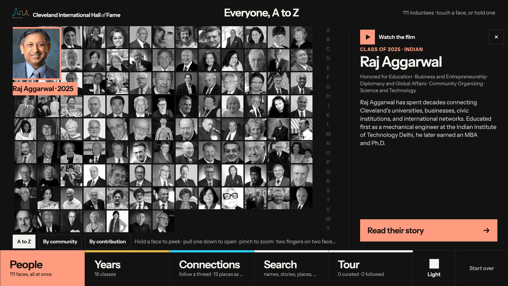
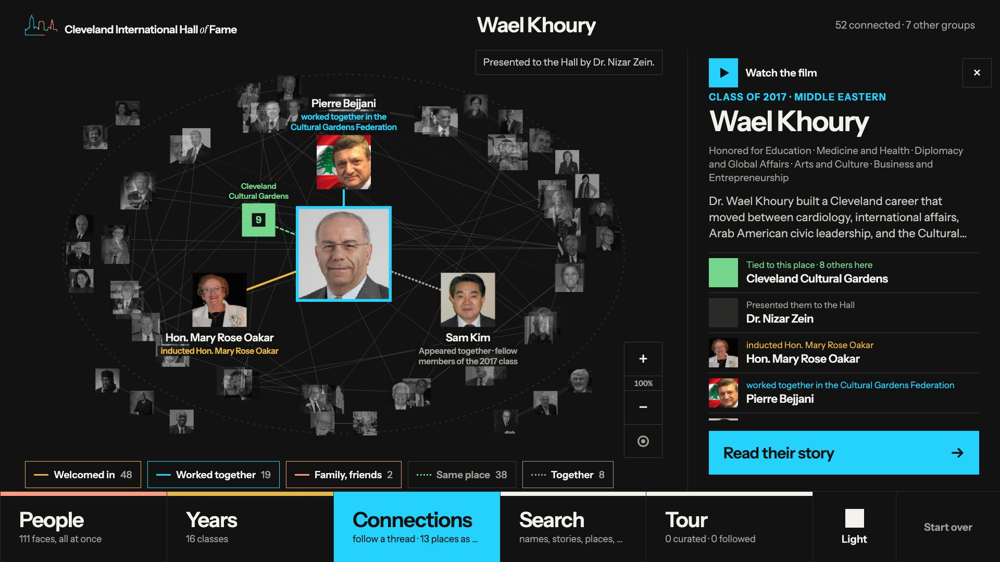
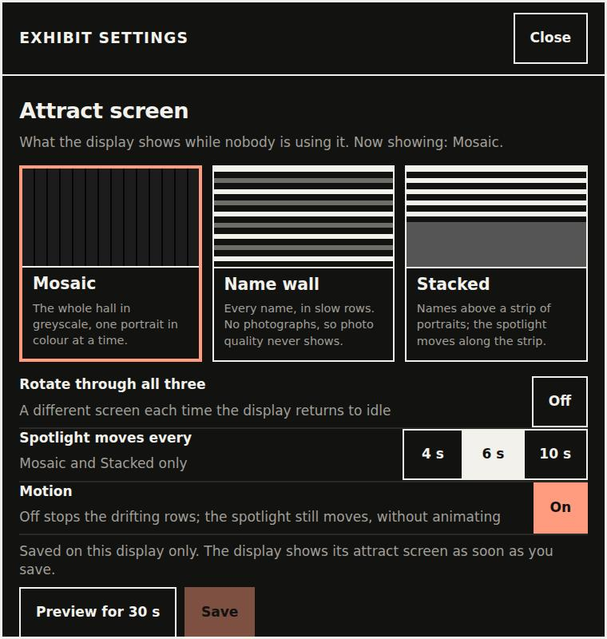

# The Hall of Fame display: a walkthrough for gallery staff

About fifteen minutes to read, and best read standing at the display. It
covers what visitors see, what to check each day, and what to do when
something looks wrong. The staff guide (`docs/staff-guide.md`, or
`STAFF-GUIDE.md` beside each release) has the full detail; section numbers
below point into it.

---

## 1. What a visitor sees

### The attract screen

When nobody is using the display, it shows the **attract screen**: every
inductee's portrait in grey, one lit up in colour at a time, and a coral
call to action. Its job is to invite someone over.

- Touching a **face** opens the wall with that person chosen.
- Touching **"Touch to enter"** (the coral bar) opens the whole wall.

There are three versions of the attract screen: portraits (as here), a wall
of names, or both. Which one shows is chosen in the admin panel (section 4
below).

### The wall

Everything is one wall of the inductees' faces, arranged in different ways.
Along the **bottom**, within reach of someone standing or seated:

- **People**, **Years** and **Connections**, each with its own colour: the
  same faces, arranged A to Z (or by community or contribution), by
  induction class, or by who is connected to whom;
- **Search**, **Tour**, **Light** or **Dark**, and **Start over**, which goes
  back to the attract screen.

Touching a face chooses that person: it turns from grey to colour, and a
panel slides in from the right with the start of their story. **Read their
story** opens the whole of it. Visitors can also hold a face to see its name,
pull a face down to open it, and pinch to zoom.

A story is turned a page at a time, with the arrows along the bottom or a
swipe. **Watch the film** sits on the portrait when there is one; **Next
story** goes on to the next face along the wall; **Back to the wall** closes
it.

**Connections** shows only relationships a curator has checked against the
records. Touching anyone brings them to the centre, and the walk builds up
along the top; **Save this thread** keeps it for the visitors after, under
**Tour**. **Same place** sets the people out where their places are in the
city.

**Search** finds names, words in the stories, communities, years, places and
what is said in the films, typed on a keyboard.

### When a visitor walks away

After a minute with nobody touching it, the display asks **"Are you still
here?"**. Twenty seconds later it goes back to the attract screen, and the
next visitor starts fresh. The only thing kept for the next visitor is a
thread someone chose to save.

---

## 2. Opening and closing

**Opening:** switch on the PC. The exhibit starts by itself and shows the
attract screen. You do not need to touch anything.

**Closing:** leaving it on is fine; it restarts itself every night at 04:00.
To switch it off, use the admin panel's **Exit to desktop**, then shut
Windows down as usual (staff guide section 3).

---

## 3. The daily glance

When you open, check three things:

- [ ] The attract screen is showing, and a portrait or name is lit up in colour.
- [ ] Touch **Touch to enter**, then a face: that person's panel opens. Touch **Start over**: the attract screen comes back.
- [ ] The screen is clean. Use a soft dry cloth, with the display showing the attract screen.

That is all. If something is wrong, see section 5.

---

## 4. The admin panel

The admin panel is hidden from visitors. To open it:

- **hold your finger on the top-left corner of the screen for 5 seconds**, or
- with a keyboard attached, press **Ctrl + Shift + A**,

then enter the passcode on the keypad. Five wrong tries lock the keypad for a
minute.

What you will use most:

| Button | When |
| --- | --- |
| **Back to the start** | The display is stuck somewhere odd. |
| **Reload** | Something looks wrong; this is the first thing to try. |
| **Restart app** | Reload did not help. |
| **Attract screen and colours** | To choose Mosaic, Name wall or Stacked, and **Dark** or **Light** colours (light suits a bright room). **Preview for 30 s** shows your choice without keeping it; **Save** keeps it and shows it straight away. |
| **This display** | The **Release** and **Content** numbers. Write them down when you report a problem. |

**Close** (top right) returns to the exhibit. The rest of the panel, and the
**Debugging** switches, are for the developer; the switches turn themselves
off at the next restart.

---

## 5. When something looks wrong

First, open the admin panel and write down **Release**, **Content**, the time,
and what you saw. Then:

| What you see | Do this | If that does not work |
| --- | --- | --- |
| A black or blank screen | Is the screen on? Is the PC on? Press the PC's power button once. | Restart the PC. |
| The display is frozen | Wait 30 seconds; it fixes a frozen page by itself. | Admin panel: **Reload**, then **Restart app**. |
| Touches land in the wrong place | Clean the screen. | Ask the Administrator to recalibrate the touchscreen. |
| The Windows desktop is showing | Start **CIHOF Exhibit** from the Start menu. | Restart the PC. |
| A film does not play | Its captions and transcript still show. | Report the person's name. |
| The keypad says **Too many tries** | Wait the time it shows. | Ask the Administrator (staff guide section 3, *Forgotten passcode*). |
| Something else | Admin panel: **Reload**. | Restart the PC, then report it. |

The full table is in staff guide section 6.

---

## 6. Things never to do

- **Never copy the exhibit's files, or its installer, to a shared or online
  folder.** It carries films approved for this display only.
- Do not leave the admin panel open. Close it when you are done; the display
  is behind it.
- Do not change Windows settings on the display PC. Ask the Administrator.

---

## Check your understanding

1. A visitor wants to see everyone from 2015. Which tab do they use? *(Years)*
2. The display shows the Windows desktop. What do you do first? *(Start
   CIHOF Exhibit from the Start menu)*
3. How do you open the admin panel without a keyboard? *(Hold the top-left
   corner for 5 seconds)*
4. What do you write down before reporting a problem? *(Release, Content,
   the time, and what you saw)*
