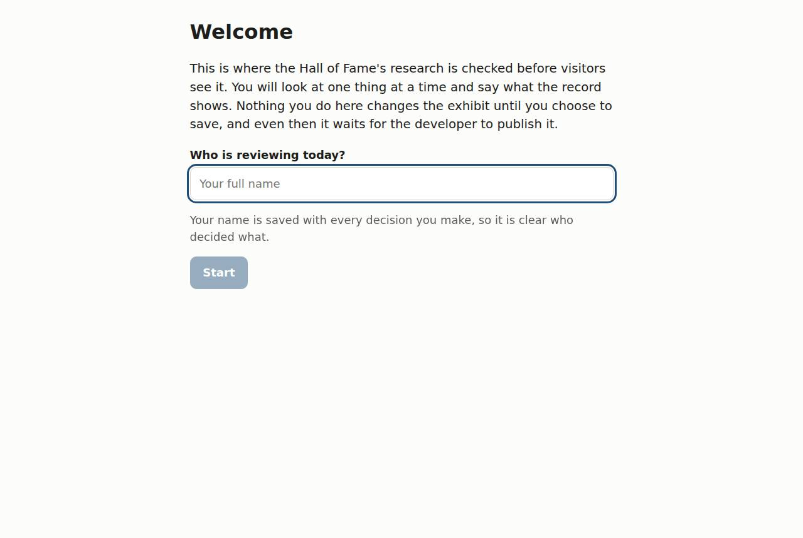
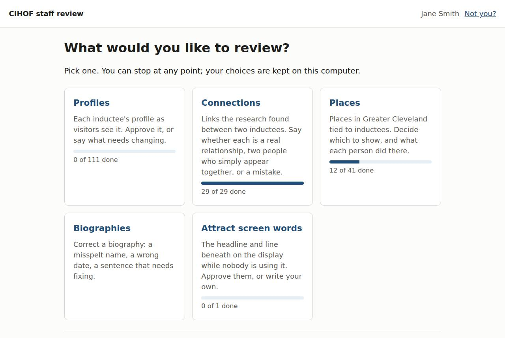
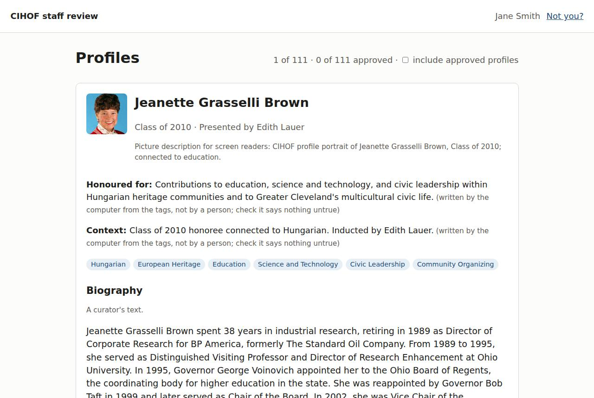
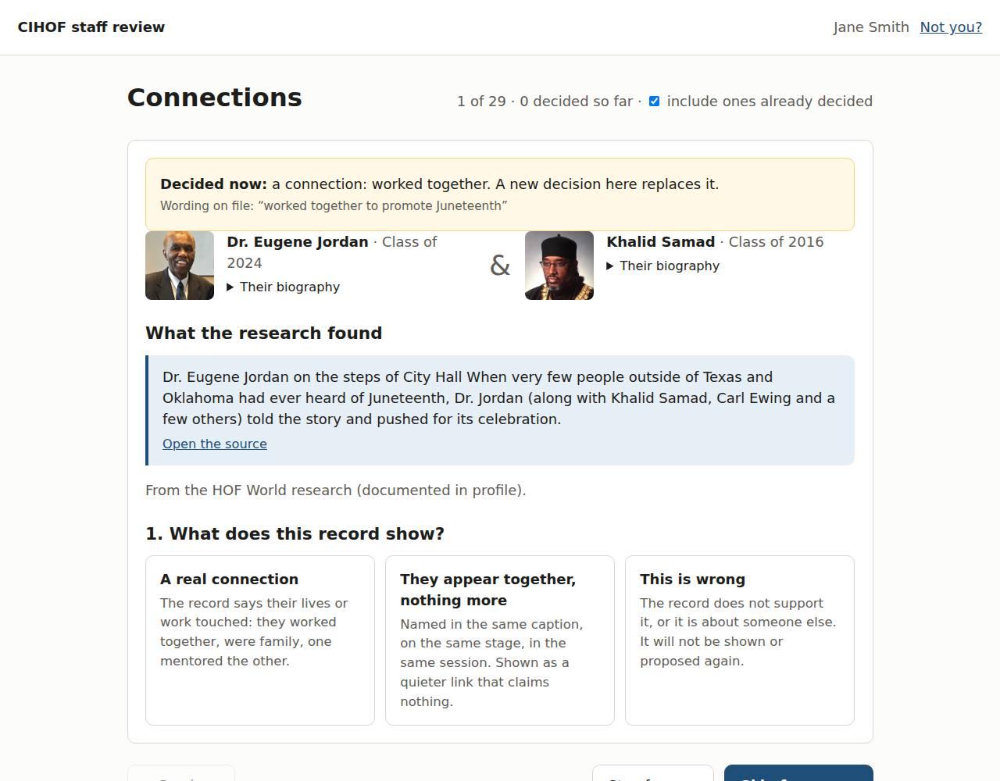
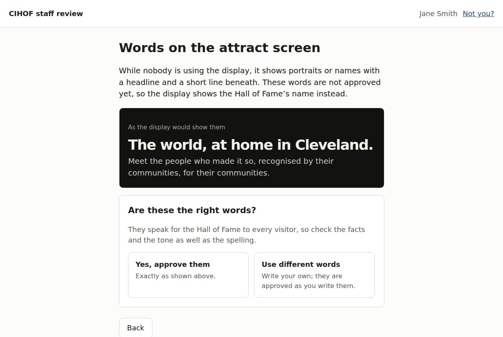

# The staff review app: a walkthrough for reviewers

About twenty minutes, at the office computer. It follows one session from
start to save. Section 7.1 of the staff guide (`docs/staff-guide.md`)
has the reference detail.

**The one idea to hold on to:** nothing you see in the app is approved by
being shown, and nothing you decide reaches the display until you save and
the developer publishes it. You can explore freely.

---

## 1. Before you start: bring the computer up to date

Once each time you sit down, in a terminal in the project folder:

```sh
git pull
npm ci
```

This brings in everything decided since last time. (If the app ever says the
project has changes that are not from the app, stop and tell the developer.)

## 2. Start the app

Double-click **Start staff review** on the desktop. A black window opens:
**leave it open** while you work. The app opens in the browser.



Enter your **full name**. It is saved with every decision, so it is always
clear who decided what.

## 3. Choose a review



Each card shows how much is done. Work on one at a time, and stop whenever
you like: every choice is kept on this computer as you make it, even if you
close the browser.

### Profiles: the main job



Each inductee's profile, exactly as visitors see it. Read it the way a
visitor would:

- the **name** and **class year**;
- the **portrait**: is it the right person?
- the lines marked *written by the computer from the tags*: these were not
  written by a person, so check they say nothing untrue;
- the **biography**.

Then choose **Yes, approve it** or **Something needs changing** (and say
what). An approval covers exactly these words and this picture; if either
changes later, the profile comes back to be looked at again.

If the biography itself is wrong, use **correct it now**. Save the
correction before you approve the profile, so the approval covers the
corrected words; the app will remind you.

*A good pace is one induction class per sitting.*

### Connections



Two inductees the research linked, with the record it came from. Decide
**from the record, not from memory**:

- **A real connection**: the record says their lives or work touched. Choose
  what kind, and write the short phrase visitors will read (60 characters at
  most, such as *worked together to promote Juneteenth*).
- **They appear together, nothing more**: a photo caption or a ceremony list
  shows them in the same place. That is not a relationship.
- **This is wrong**: the record does not support it.

### Places and Biographies

**Places**: first the words visitors read about the place. Approve them
as they are, use the plainer wording the app suggests, or write your own;
an approval covers exactly those words. Places already on the display that
were approved before approvals recorded the words come back once, to be
checked. Then say what each person did there (lived, worked, studied,
taught, organized, served, founded).
**Biographies**: search for a person, correct the text, and check the
highlighted changes before keeping them.

### Attract screen words



The headline and the line beneath it on the display while nobody is using
it. They speak for the Hall of Fame to every visitor, so check the facts and
the tone as well as the spelling. **Approve them**, or **use different
words**: your own words are approved as you write them. Until they are
approved, the display shows the Hall of Fame's name instead, so leaving them
is always safe.

## 4. Check and save

When you have made some decisions, the home page shows **Check and save**.

1. The summary lists everything you decided. Anything unfinished is named;
   finish it or clear it.
2. If you kept any connections, choose who may see them: **the exhibit
   only** is the usual choice.
3. **Check my decisions.** The app runs every check without saving
   anything. If something needs fixing, it says what.
4. **Save.** Each kind of review is saved separately, with your name.
5. **Tell the developer.** Your decisions reach the display only when the
   developer publishes them.

If a save stops part way, the part that failed is not kept and your
decisions for it are still there. Show the details to the developer.

---

## Check your understanding

1. A photo caption lists two inductees at the same dinner. What do you
   choose? *(They appear together, nothing more)*
2. You approved a profile, then noticed a typo in its biography. What now?
   *(Clear the approval, correct the biography and save it, then approve
   again)*
3. You saved. Is it on the display? *(Not yet: tell the developer, who
   publishes it)*
4. Can you break the display from this app? *(No. Nothing leaves this
   computer until the developer publishes it.)*
