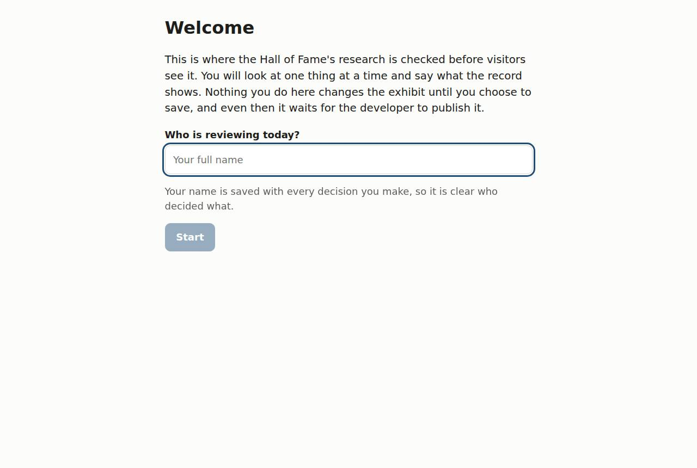
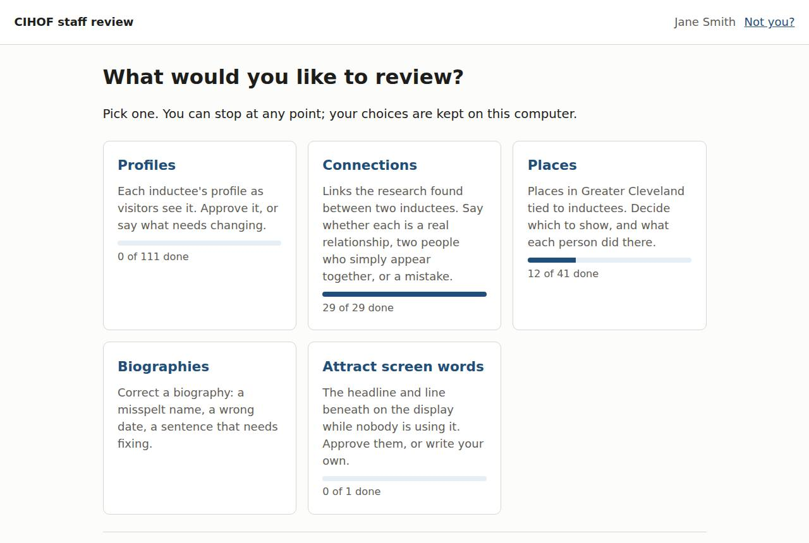
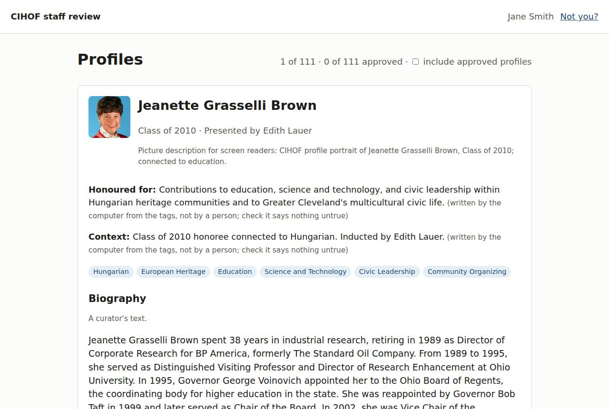
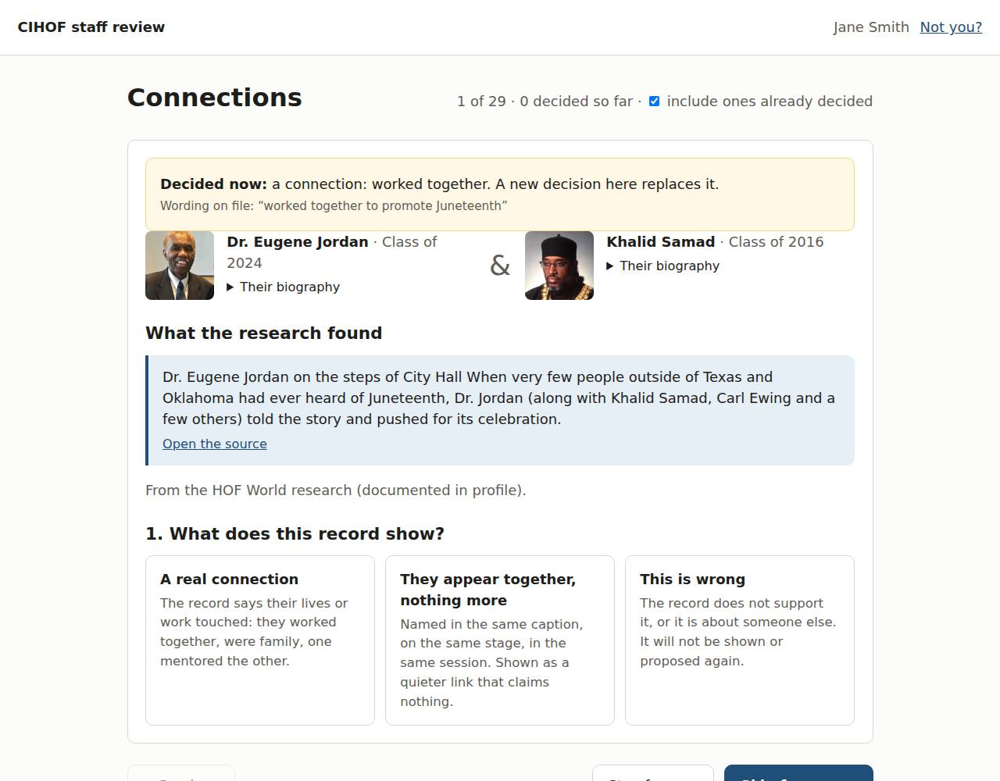
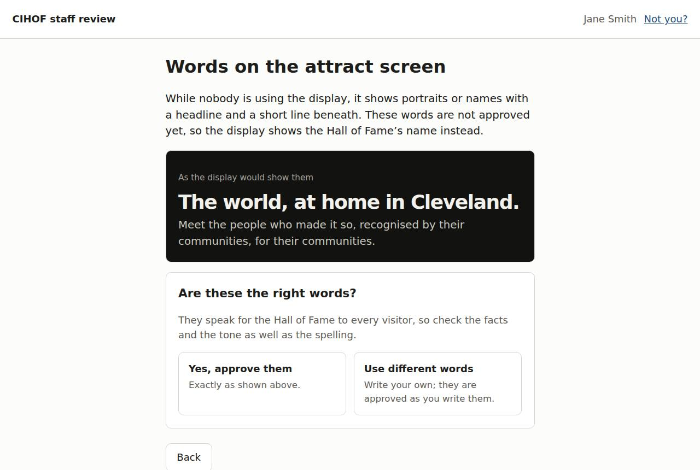
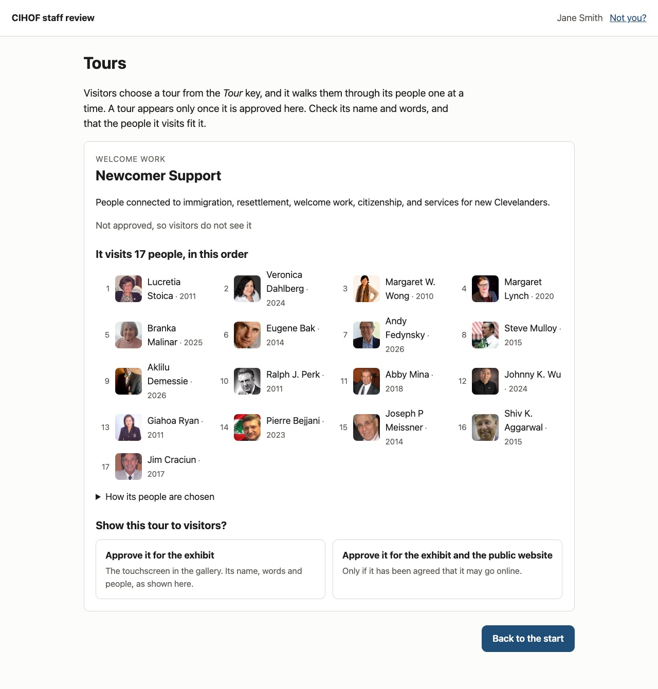

# The staff review app: a walkthrough for reviewers

About twenty minutes, at the office computer. It follows one session from
start to save. Section 7.1 of the staff guide (`docs/staff-guide.md`)
has the reference detail.

**The one idea to hold on to:** nothing you see in the app is approved by
being shown, and nothing you decide reaches the display until you save and
the developer publishes it. You can explore freely.

---

## 1. Before you start

There are two ways to run the review. Ask the developer which is yours.

- **The CIHOF Staff Review app**, installed on your computer. There is
  nothing to bring up to date: each time it opens, it copies the latest
  records from the data folder the developer keeps. The first time, it asks
  you to choose that folder.
- **The project folder**, on the office computer that holds a copy of the
  project. Once each time you sit down, in a terminal in the project folder:

  ```sh
  git pull
  npm ci
  ```

  This brings in everything decided since last time. (If the app ever says
  the project has changes that are not from the app, stop and tell the
  developer.)

## 2. Start the app

Open **CIHOF Staff Review** from the Start menu, the Dock or the desktop. It
opens in a window of its own. The first time, choose the data folder the
developer set up (the one with a folder called *data* inside it). If that
folder cannot be reached, for example because the shared drive is not
connected, the app says so in its title bar and uses the records it copied
last time.

On the project computer instead, double-click **Start staff review** on the
desktop. A black window opens: **leave it open** while you work. The app
opens in the browser.



Enter your **full name**. It is saved with every decision, so it is always
clear who decided what.

## 3. Choose a review



Each card shows how much is done. Work on one at a time, and stop whenever
you like: every choice is kept on this computer as you make it, even if you
close the browser.

### Profiles: the main job



Each inductee's profile, exactly as visitors see it. Read it the way a
visitor would:

- the **name** and **class year**;
- the **portrait**: is it the right person?
- the lines marked *written by the computer from the tags*: these were not
  written by a person, so check they say nothing untrue;
- the **biography**.

Then choose **Yes, approve it** or **Something needs changing** (and say
what). An approval covers exactly these words and this picture; if either
changes later, the profile comes back to be looked at again.

If the biography itself is wrong, use **correct it now**. Save the
correction before you approve the profile, so the approval covers the
corrected words; the app will remind you.

**Edit this profile** changes the rest of what visitors read: the name and
how it is alphabetised; the communities, honours and countries (choose from
the tags already in use where one fits); the two lines under the name; and
the picture's description and where the face sits. The profile is shown
beside the form as it would be. The two lines were first written by the
computer from the tags and do not change when the tags do: keep a line, use
**the computer's wording** for the tags as they are now, or write your own,
which is then shown as a curator's words. The class year and who presented
them come from the Hall of Fame's own records and cannot be changed here.
**Keep these changes**, save them, and then approve the profile, so the
approval covers it as edited. **Find a person** goes straight to anyone,
approved or not.

*A good pace is one induction class per sitting.* The classes run along the
top of the screen, each with how many are approved: choose one to work
through it alone. **Next undecided** skips what you have decided, and **As
on the display** shows the profile the way visitors will see it. With no box
selected, **A** approves and the arrow keys move on and back.

### Connections



Two inductees the research linked, with the record it came from. Decide
**from the record, not from memory**:

- **A real connection**: the record says their lives or work touched. Choose
  what kind, and write the short phrase visitors will read (60 characters at
  most, such as *worked together to promote Juneteenth*).
- **They appear together, nothing more**: a photo caption or a ceremony list
  shows them in the same place. That is not a relationship, and visitors
  are not shown it.
- **This is wrong**: the record does not support it.

### Places and Biographies

**Places**: first the words visitors read about the place. Approve them
as they are, use the plainer wording the app suggests, or write your own;
an approval covers exactly those words. Places already on the display that
were approved before approvals recorded the words come back once, to be
checked. Then say what each person did there (lived, worked, studied,
taught, organized, served, founded).
**Biographies**: search for a person, correct the text, and check the
highlighted changes before keeping them.

### Attract screen words



The headline and the line beneath it on the display while nobody is using
it. They speak for the Hall of Fame to every visitor, so check the facts and
the tone as well as the spelling. **Approve them**, or **use different
words**: your own words are approved as you write them. Until they are
approved, the display shows the Hall of Fame's name instead, so leaving them
is always safe.

### Tours



The curated tours a visitor chooses from the **Tour** key. Each shows its
name and words, whether it is on the displays, and the people it visits, in
order. Check that the words are right and that the people fit the theme, then
**approve it for the exhibit**, or **for the exhibit and the public website**
if it has been agreed that it may go online: the two are decided apart, as
for connections. An approved tour can be **taken off** again. Its people are chosen from the
published biographies and honours by words and honours the curators set
(under *How its people are chosen*). If those rules or the tour's words
change after you approve it, it comes off the displays until somebody
approves it again.

**Edit this tour** opens the tour editor. Change its name, the line above it
and what it is about, and watch them on a copy of the card visitors see in
the Tour key. Change who it visits: drag someone to a new place (or use the
arrows), **Leave out** someone who does not belong, or **Add someone** by
name. Whoever you move, and everyone above them, keeps that order; below
them the tour's words and honours choose as before, and you can change those
too, along with how many people it visits at most. The list always shows who
the tour would visit, worked out as the display would. **Keep these
changes**, then **approve it as edited** for the exhibit (or the exhibit and
the website), or **leave it for somebody else to approve**. Either way the
changes are saved with your other decisions, and until it is approved as
edited the tour stays off the displays.

**Start a new tour** opens the same editor on an empty tour. Give it a name,
the line above it and a few words about it; add the people it should visit,
or words and honours to choose them by, or both. **Keep these changes**, and
it waits at the top of the card, marked *A new tour, not yet saved*, until
you choose: **approve it** for the exhibit (or the exhibit and the website),
or **leave it for somebody else to approve**. It cannot be saved until you
have chosen. **Edit my new tour** changes it again; **Discard this new
tour** throws it away.

**Delete this tour**, at the foot of a tour, removes it altogether: off the
exhibit and the website, and out of the tours here. The app asks once more
before it marks the tour *To be deleted when you save*, and **Don’t delete
it** changes your mind until you save. To keep a tour but stop visitors
seeing it, take it off the displays instead; it can be approved again
later.

### Film titles

What each film is called in a person's list of films on the display.
Without a title, the display describes a film by its length (*A 7-minute
film*). Each film comes with the title it has on YouTube, written by whoever
posted it. **Check it** before you use it: the spelling of the names, and
anything it says about who inducted whom. Then **use the YouTube title**, or
**write a title** of your own. Type a name into *Find a person* to go
straight to their films.

### Where ceremony films start

Six inductees from 2024 share one film: the whole ceremony, an hour and
three quarters long. For each of them, the app suggests where their part
begins, shows what the captions say there, and links to the film from that
second. **Watch before choosing**: the captions mishear names (Erika
Puussaar's comes out as *"Erica pisar"*). Then choose **Open at…**, type **a
different time**, or keep **From the beginning**.

### Film captions and transcripts

The films' captions were made automatically, and the transcripts from the
captions. The app finds two kinds of mistake by itself: music written as the
word *heat*, and *[BLANK_AUDIO]*. For each film it shows where they are and
how the words would read after the fix. **Mark it [music]** or **Remove
it**. Check the examples first: *heat* is sometimes a real word.

For a misheard name, choose the film, type the words as they are (*Carolyn
Varo*) and as they should be (*Carolyn Balogh*). The app tells you where it
found them before you **Add this correction**. Every fix changes the
captions and the transcript together.

### New inductees

In the staff portal, and in the project. Each year's class is added here, one
person at a time, from the Hall of Fame's own record of the induction: the
full name (and the name visitors see, if different), how the name is
alphabetised (the app suggests *Brown, Jeanette Grasselli* from *Jeanette
Grasselli Brown*; check it), the class year, the region, who inducted them,
the biography in the institution's own words, their page on the Hall of
Fame's website if they have one, their communities, honours and countries,
and a portrait with its description. Tick that the museum may show the
portrait, or leave it unticked to add them with the portrait kept off the
display until somebody confirms it. A new tag the collection has not used
before is pointed out when you check: make sure it is spelt like the others.

Once saved, they are in the exhibit like everybody else: approve their
profiles, write what they are honoured for in the profile editor, and add
their films under Portraits and films.

### Portraits and films

In the staff portal, and in the project, not where decisions are exported
for the developer: the files you choose stay on your computer until saved.
Choose a person to see their portrait and films.

- **A new portrait.** Choose a photograph (JPEG, PNG or WebP). The app makes
  it a JPEG no larger than 1600 pixels on its long side. Describe it for
  people who cannot see it, and tick that the museum has the right to show it
  permanently. The old picture is kept, and the profile needs approving again
  with its new picture.
- **Add a film.** Choose an MP4. The app plays it: a film that cannot be
  played here could not be played on the display either. Play it to a good
  moment and **Use the picture showing now as its poster**. Choose its
  captions (.vtt or .srt); they show on the film so you can check them. The
  transcript is made from the captions: correct anything wrong. Give it a
  title if you like, tick the three confirmations (rights, captions checked,
  transcript checked), and **Add it to my decisions**. A large film takes a
  while to send to the app; the page counts it up.
- **Take it off the display** hides a film, keeping its record.

A display update carries new films to the display with everything else.

### Sign-offs

Each sign-off (the logo, a section of the sign-off sheet, the approval to
open) is accepted here by the person responsible. Read what it confirms,
then **Accept as** your name: the app signs it with your name and today's
date. Add a note where it helps (measurements, an exception and who accepted
it); the two decisions about the website and audio description ask what was
decided. Accept only what is yours to sign, and never for someone else: if
it is theirs, they enter their own name (*Not you?* at the top) and accept
it. The approval to open appears once sections 1 to 6 are signed. **Clear** undoes a sign-off
accepted by mistake, or one that no longer holds, with the reason.

### History

The link at the foot of the home page lists every decision so far: what, who
and when, with the sheet each one rests on. Nothing there can be changed.

### Ready for opening?

The box at the top of the home page lists what is still open before the
exhibit opens: your reviews, and the sign-offs other people give. It fills in
by itself as work is saved; nothing in it is ticked by hand.

## 4. Check and save (or export)

When you have made some decisions, the home page shows **Check and save**,
or in the CIHOF Staff Review app **Check and export**.

1. The summary lists everything you decided. Anything unfinished is named;
   finish it or clear it.
2. If you kept any connections, choose who may see them: **the exhibit
   only** is the usual choice.
3. **Check my decisions.** The app runs every check without saving
   anything. If something needs fixing, it says what.
4. **Save.** Each kind of review is saved separately, with your name.
   In the app, **Export** instead: your decisions go into one file in
   **Documents › CIHOF review decisions**, and leave the app's list so they
   cannot be sent twice. **Show the file** opens that folder.
5. **Tell the developer**, and in the app **send them the file** (by email,
   or on the shared drive). Your decisions reach the display only when the
   developer brings them in and publishes them. If something you approved
   has changed in the meantime, it comes back to you to look at again.

If a save stops part way, the part that failed is not kept and your
decisions for it are still there. Show the details to the developer. History
in the app lists the files exported from your computer.

## 5. The staff portal: changing what the display shows

The same app also works on what a display shows now, with nobody in
between. Changes made this way reach the display as a **display update**, a
file you load on the display yourself.

1. **Export the display's content.** On the display, open the admin panel,
   then **Content › Export current content…**, and save the file to a USB
   stick.
2. **Open it in the app.** **File › Open a display's content…** and choose
   the file. The window's title becomes **CIHOF staff portal**. If changes
   you saved earlier are not yet in a display update, the app asks before
   opening, since opening replaces them with what the display had.
3. **Make your changes** with the same reviews as above, then **Check and
   save**. Saving writes them into the app's copy straight away, each kind
   with your name. Nothing has changed on the display yet.
4. **Make a display update.** From the save page, or from the foot of the
   home page. Add a line saying what changed if you like. The file goes to
   **Documents › CIHOF display updates**; **Show the file** opens that
   folder. It takes a moment: the app builds the display's content from your
   copy exactly as the exhibit is built.
5. **Load it on the display.** Copy the file to a USB stick. On the display,
   **Content › Load a content update…**, read what it says it changes, then
   **Apply and show now** or **Apply at the next reset**.

Keep working in the app afterwards: the next display update follows this one.
The display keeps its earlier content, and the content it was delivered with,
so it can always go back (**Content › Versions kept**). If two people change
the same display from the same export, the second update is flagged on the
display: export again and make it from that.

To go back to reviewing the developer's records, choose **File › Choose the
data folder…**.

---

## Check your understanding

1. A photo caption lists two inductees at the same dinner. What do you
   choose? *(They appear together, nothing more)*
2. You approved a profile, then noticed a typo in its biography. What now?
   *(Clear the approval, correct the biography and save it, then approve
   again)*
3. You saved. Is it on the display? *(Not yet: tell the developer, who
   publishes it)*
4. Can you break the display from this app? *(No. Nothing leaves this
   computer until the developer publishes it, or, in the staff portal, until
   you load a display update, which the display checks first and can always
   undo.)*
5. In the staff portal you saved a correction. Is it on the display? *(Not
   yet: make a display update and load it on the display)*
